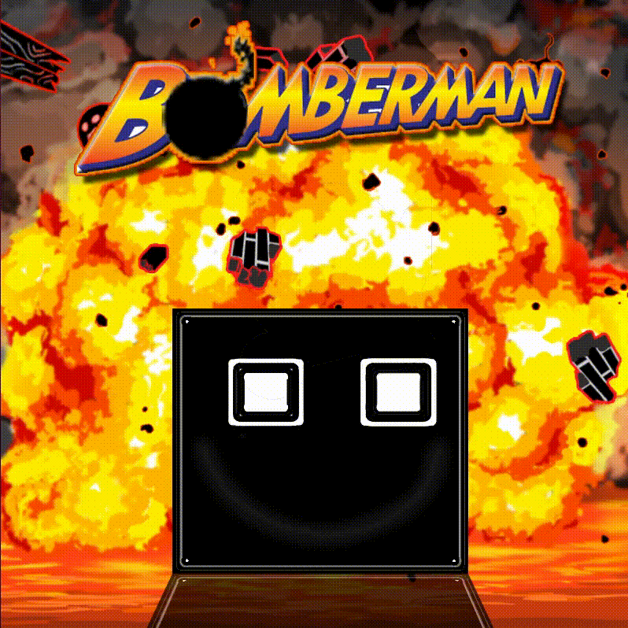

## Bomberman Two-Players Game ##

Bomberman game developed with Python and pygame library. 

This development was born because we had to create a software with some user interaction for an Algorithm class on my College, I didn't want to create a calculator or something so simple because i already knew programming before starting my career, so I went straight to creating a mini-game!

